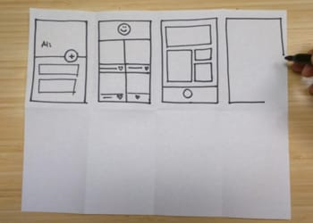
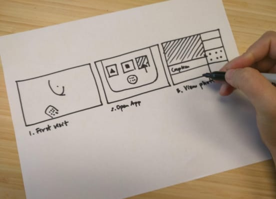
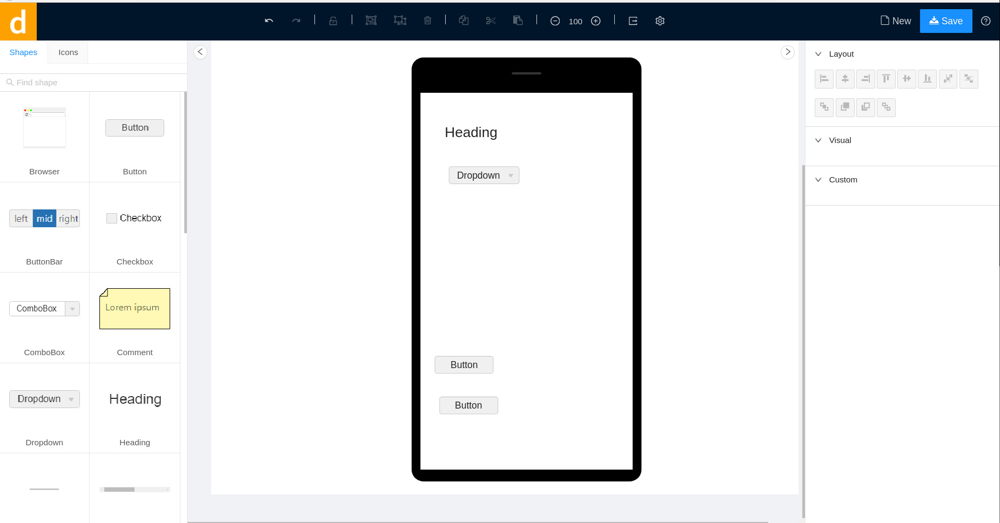

### Overview of the day

- check-in / challenges
- review metrocard redesign
- Design Methodology
  - in-class coding
- mockups and prototyping with mydraft.cc 
- Assignment: Co-Creating a UI with Research, Prototyping, Testing

## User Experience Design Methodology

Recall that this method is in contrast to the "Waterfall" method. Instead of lots of research from a client with a long design-build stage we will do iterative rapid prototyping with potential users of our interface.

#### 1. Create a Design Brief

Ask yourself “what is the problem I’m actually trying to solve?"

It may be for a new interface and project, or an adaptation to one that already exists.

Answering this question results in your *project brief* and indicates your goal. This is the purpose of your interface and application. The answer should be a succinct statement focused on your audience and goals.

You should place this design brief in a prominent position. Return to it throughout the project design to make sure you're keeping to your goals. You may want to alter and refine it as you work on the project.

#### 2. Co-Design with Stakeholders

Once you have your design brief you need to verify that this matches your audience's needs and goals.

> The next step is to research the challenge and learn about the problem. What you need to discover is whether your team's understanding of the problem is valid. Quite often we look at problems from our own point of view, which is dangerous as most of us in tech are actually power users and are in fact a minority of users. We are a vocal minority and can be fooled into thinking something is actually a problem when it isn’t. *--Web UX Fundamentals, [Google Developers](https://developers.google.com/web/fundamentals/design-and-ux/ux-basics)*

There are a number of ways to do this including: internal interviews, user interviews, field research. Generally one method is used.

##### Research Method 1 - Internal reviews

This is done with your own team/collaborators. Fast, find your best goals. Not as favored as independent user interviews.

##### Research Method 2 - User interviews

Convene at least five interviewees. Ask them questions relating to the design brief. This is considered the most ideal approach to follow when it's feasible.

Example questions:
 - what challenges do they face?
 - what do they already use to accomplish that task/activity?
 - show them prototypes - what do they like/dislike about this plan?
 - what similar programs do they like?
 - what would they change?

The goal is to gather research/data, then update your design brief.

##### Research Method 3

Field Research means you find users in public and observe their behavior in context. Users may think they have a particular need or pattern, but it may turn out that their own actions diverge from what they think. In this method you observe without participating or interfering.

Based on your gathered research, revise your design brief.

#### 4. Wireframing Activity and Storyboarding

Using a notebook or digitally sketch simple wireframes and sketch layouts. These should be throwaway designs, very rapid. Iterate on your design until you feel satisfied with the basic layouts. You may want to sketch these to size. Remember these can be very loose or very detailed. Consider the sketchbook Metrocard screen sketches of David Reinfurt. He sketched out 4 potential layout options and then drew out a wireframe and storyboard showing the flow between screens.

#### 5. Prototyping

Based on your wireframe and storyboarding it's time to build a prototype. You may begin with a more detailed paper prototype or be ready to jump to sketching digitally. We've covered a number of tools like Figma, Wireframe.cc, Sketch and even simplified applications like Keynote as prototyping tools. The goal of this step is to produce something that appears/looks like a real finished app. Remember however that you will do further refinements later based on user testing.

#### 6. Usability Testing

Now is the time to gather people to test your design. You'll let them interact with your prototype, by pressing, clicking, potentially "even Wizard of Oz" approaches like we learned about from David Reinfurt's test of the prototype Metrocard screens.

Like our earlier co-designing session it's best to observe rather than engage in a back-and-forth conversation as you do not want to influence their actions. Ask questions to find out what the user likes, dislikes, finds intuitive, confusing, and whether it meets their needs.

##### 7. Refinement and Building

Based on user usability testing you'll go back to the design and refine it. You made need to do more usability testing.

Based on this work it's time to build the interface by translating your revised prototype into code.

##### 8. User Testing (and Refinement) Loop

Like our earlier usability testing, after you've built the first version of the interface in code you'll need to test and observe its use. Based on this you will likely need to do successive layers of building, refinement and testing until you get to a final version everyone is happy with.

## In-class Activity - Following our User Experience Design Methodology to create Prototypes and Crazy 8s

1. Design brief

Spend 10-20 minutes brainstorming *app* ideas that would augment your life, something that would be specific to you and/or perhaps a friend or family member. Just make a list. It's important to get all of your ideas out. Good ideas, bad ideas. Capture the ideas down with a word or phrase or sentence. Don't judge them yet. Don't consider them in detail yet. Just put them down and let them sit in a list.

2. Research

Now find a partner and interview them. Conduct design research and from this create a design brief based on their needs. Spend a few minutes refining your concept. Ask them questions. Follow our User Experience Design Methodology.

##### In-class Activity - Crazy 8s

3. Paper Prototyping

Fold a sheet of paper so you have 8 panels.



In each panel draw a prototype sketch for your interface based on your research so far.

⌛ You have exactly [10 minutes](https://e.ggtimer.com/10%20minutes) to spend sketching 8 potential UIs. This is not a time for tiny details.

4. Refinement

Now meet with your partner and compare your designs. Spend a few minutes analyzing them. Which design seems most promising? Add any details that come up in discussion.

5. Paper Mockup

⌛ Now spend 10 minutes sketching out one of the designs in more detail. You can each work separately or choose to work together.



6. Flowchart (Storyboard)

⌛ From this sketched design it's now time to draft a storyboard. This is a workflow showing step by step screens in successive order by a user. Sometimes you may want to demonstrate branching options and flows.

Continue to follow the design methodology:
- Prototyping
- Usability testing
- Refinement and further usability testing

### wireframing and mockups

7. mockup with design software

There are many programs free and paid for creating mockups of interfaces. Some of the most common are [Figma](https://www.figma.com), a freemium/paid web-based application, and [Sketch](https://www.sketch.com/), a Mac-only UI prototyping application that runs on the Mac desktop. Other options include Adobe's XD, a freemium/paid Mac/Windows desktop software.

Note: Freemium applications are paid for-profit software that also includes a *free tier* level of use. These free tiers are usually limited in their options, such as adding watermarks, preventing sharing or collaboration, or preventing saving or exporting.

These programs work well, but I wanted to also present a free and open source wireframing/mockup tool: 

- [mydraft.cc](https://mydraft.cc/) - simple and no sign-in
- [penpot](https://penpot.app/) - more full-featured, appears similar to Figma



8. Test out your prototype with user testing

Now find a new group of people to test out your prototype. Ideally they would be able to test both the UI and the flowchart (keep in mind the Metrocard machine *Wizard of Oz* tests with a *dummy* machine).

Take notes. Have questions? Observe. How does your design brief need to be refined, if at all? How does your interface need to be refined?

### 9. Last step! From prototype to first version in code

Now that you have a refined design brief, some paper prototypes, digital mockups and use testing under your belt, you are ready to code up your interface. 

We will use our HTML and CSS tools to build a version of the interface. Use ```<a href="">``` anchor links to jump between screens. *For this assignment, you do not need to actually present the functionality of the application or interface that you are prototyping*. In other words, if you are making a phone application interface, you do not need to code a functional phone! If you are building a messaging app or chatroom, you do not need to actually build that application. The emphasis is on the interface aspect.

## Homework:

##### Reading

Review [Google Developer UX Basics](https://developers.google.com/web/fundamentals/design-and-ux/ux-basics).

##### Activity: Co-Design and Prototype

Begin by asking "what is the problem I’m trying to solve?"

A completed assignment includes:

Week 1 (due March 10):

- 1. Design Brief statement
- 2. Crazy 8's drawings
- 3. Take one of your crazy 8's drawing and do a more detailed Pen/pencil/paper mockup layout 
- 4. Create a flowchart of your app showing the different screens
- 5. Digital prototypes (using mydraft.cc or Figma or your chosen software)

Week 2 (due Mar 17):

- 1. Notes from your user usability testing of your prototype
- 2. Your second refined version of your prototype (digital mockup)
- 3. Your programmed interface

#### Resources

- [Somebody App](http://somebodyapp.com/) by Miranda July, developed by Stink Studios (and its [blog](https://somebodyapp.tumblr.com/) of messaging delivery recaps)
- [UX Basics](https://developers.google.com/web/fundamentals/design-and-ux/ux-basics) by Google Developers
- [Responsive Web Design Basics](https://developers.google.com/web/fundamentals/design-and-ux/responsive) by Google Developers
- [Graphical User Interface Gallery](http://toastytech.com/guis/index.html) containing user interfaces from various operating systems from 1980s to today

[Article](https://uxplanet.org/the-magic-of-paper-prototyping-51693eac6bc3) on paper prototyping
  

